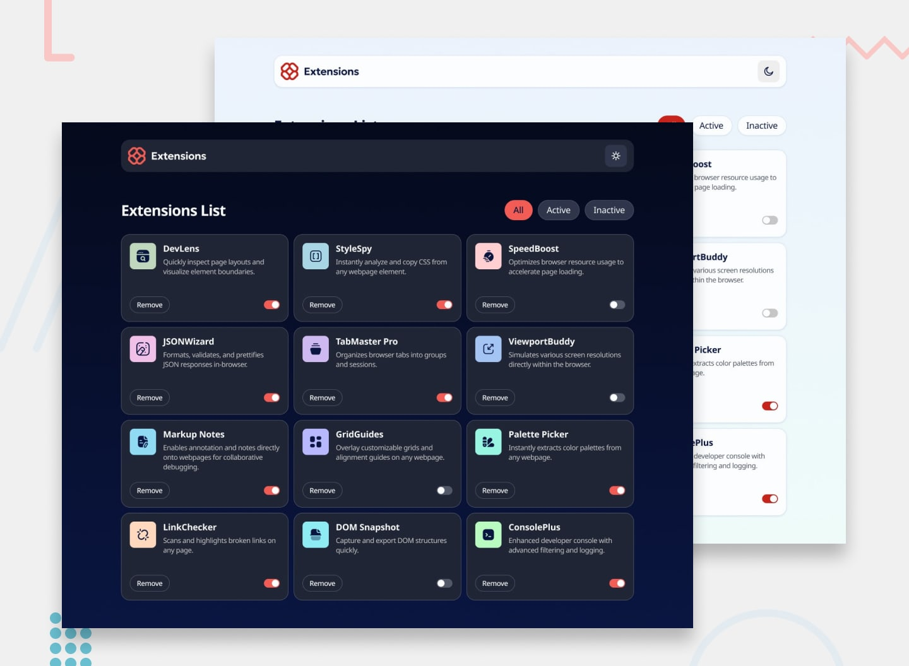

# Browser Extensions Manager

A responsive Browser Extensions Manager built with HTML, CSS, and JavaScript. This project allows users to manage browser extensions through filtering, activation/deactivation, removal, and theme switching.

## 🚀 Live Demo

[View Live Project](https://shrushti028.github.io/browser-extensions-manager/)

## 📸 Preview

## ✨ Features

- View all browser extensions dynamically from `data.json`
- Filter extensions by:
  - All
  - Active
  - Inactive
- Toggle extensions between active and inactive states
- Remove extensions from the list
- Dark and light theme switching
- Responsive layout for desktop, tablet, and mobile screens
- Hover and focus states for interactive elements
- Dynamic UI updates using JavaScript
- Responsive card grid layout

## 🛠️ Built With

- HTML5
- CSS3
- JavaScript
- CSS Grid
- Flexbox
- JSON
- Git & GitHub
- GitHub Pages

## 📚 What I Learned

While building this project, I strengthened my understanding of:

- DOM manipulation and dynamic rendering
- Working with arrays and array methods such as `filter()`
- Handling click and change events
- Managing application state using JavaScript
- Dynamically generating HTML elements
- Implementing filtering functionality
- Building reusable UI components with JavaScript
- Responsive layouts using CSS Grid and media queries
- Creating dark/light theme functionality
- Implementing accessible focus states
- Debugging and testing frontend functionality
- Deploying a frontend project using GitHub Pages

## 📂 Project Structure

browser-extensions-manager/
│
├── assets/
│   └── extension images and icons
│
├── design/
│   └── Frontend Mentor reference designs
│
├── data.json
├── index.css
├── index.html
├── script.js
├── preview.jpg
├── style-guide.md
└── README.md
